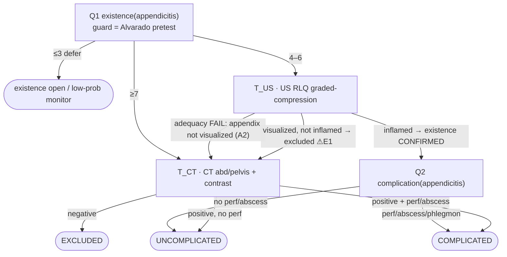

# Appendicitis — Q↔T tree (transformed from `rubric_graph_original.py`)

> **Step 0 of the revised build order (`rubric_update.md` §6i/§7).** This is the *base* spine:
> the original WSES-2020 appendicitis sub-rubric re-expressed as the §6 alternating **question↔test**
> state machine. Nothing here is invented — every node/guard/fork is traced to a line in
> `pipeline/rubric_graph_original.py::_build_appendicitis_graph`. `required(S)`/`coverable(S)` cells are
> marked **[seed]** where I filled standard imaging knowledge (to be validated against `sought_dimensions`
> + verification mining, per the §6c recipe — clustering ≠ gates). Extension candidates the transform
> *exposed* are quarantined in the last section — they are NOT part of the base.

## 0. Labeling convention (口径 — confirm this first)

| element | rule used |
|---|---|
| **Question node** | a rubric node whose job is to *decide about a hypothesis*: `start`/`assessment`-that-stratifies + every `decision` node. Tagged with one of {existence, etiology, severity, complication}. |
| **Test node** | a rubric node that *orders/consumes a study*: typed `(modality, region, protocol)`, keyed by `required_tests`. |
| **Q→T edge = guard** | lifted verbatim from `edge.condition` on edges leaving a question. Reads the **accumulated state** (pretest, prior-adequacy, demographics). |
| **T→Q = two stages** | (1) **adequacy gate** `required(q) ⊆ covered(report)?` — fail → re-image edge (A2); (2) **answer-fork** on the result value → advance/branch (A1). The rubric usually collapses these two; where it does, I split them and flag it. |
| **question-node identity** | `(type, disease, [sub_question])`; `required(S)` is keyed here, NOT on the test, NOT on depth (§6j). |

## 1. Question nodes (Q)

### Q1 — `existence(appendicitis)`  *(rubric: SUSPECTED → ALVARADO)*
- **Question:** is this appendicitis?
- **Guard state read to route:** `pretest_prob` = **Alvarado score** (computed from `Lab_Panel` + PE; rubric `ALVARADO.required_tests=["Lab_Panel"]`).
- **`required(S)` [seed]** — dims that answer "is the appendix inflamed":
  | anatomy | attribute | note |
  |---|---|---|
  | appendix | diameter | threshold >6 mm |
  | appendix | wall_thickness | |
  | appendix | wall_enhancement | needs IV contrast (→ type ③ if non-con) |
  | appendix | compressibility | US graded-compression only |
  | appendix | appendicolith | |
  | periappendiceal | fat_stranding | |
  | periappendiceal | fluid | |

### Q2 — `complication(appendicitis)`  *(rubric: US_FINDINGS, and the perf/abscess arm of CT_FINDINGS)*
- **Opens only after** existence == confirmed.
- **Question:** perforation / abscess / phlegmon present?  → uncomplicated vs complicated.
- **`required(S)` [seed]:**
  | anatomy | attribute |
  |---|---|
  | appendix | perforation / wall_defect |
  | periappendiceal | abscess |
  | periappendiceal | phlegmon |
  | peritoneum | extraluminal_air |
  | peritoneum | free_fluid (large-volume) |

> **No `etiology` node** (appendicitis etiology = luminal obstruction; the guideline does not work it up).
> **No separate `severity` node** — the uncomplicated/complicated split IS the severity axis here, but it
> is mechanistically a *complication* check, so it is labeled `complication`. (This is exactly the §7.1
> open question "are severity & complication distinct types" — appendicitis is the disease where they fuse.)

## 2. Test nodes (T) — `(modality, region, protocol)`

| id | modality | region | protocol | `coverable(S)` [seed] | limits (→ inadequacy type) |
|---|---|---|---|---|---|
| **T_LABS** | labs | systemic | CBC+diff | WBC, left-shift (feed Alvarado, not imaging) | — |
| **T_US** | ultrasound | RLQ | graded compression | appendix {diameter, compressibility, wall, appendicolith}, periappendiceal fluid | retrocecal / obese / bowel-gas → appendix **non-visualized** (① VIS); cannot grade perforation extent (④ CAP) |
| **T_CT** | CT | abdomen/pelvis | IV contrast | ALL existence + complication dims | non-contrast → no wall_enhancement (③ PROT) |

## 3. Q→T guards (lifted from `edge.condition`)

| from | guard (state predicate) | to test | rubric line |
|---|---|---|---|
| Q1 existence | `alvarado ≤ 3` (low pretest) | — → **defer** (OBSERVE / EXCLUDED_LOW) | `ALVARADO→OBSERVE` |
| Q1 existence | `4 ≤ alvarado ≤ 6` (intermediate) | **T_US** | `ALVARADO→US_ABDOMEN` |
| Q1 existence | `alvarado ≥ 7` (high) | **T_CT** | `ALVARADO→CT_ABD_HIGH` |

**Demographic guards present in the rubric as prose (not yet computable) — surfaced as enriched-state candidates:**
`US preferred for child / pregnant / young-female` (`US_ABDOMEN.desc`); `male < 40y may go direct to surgical consult` (`CT_ABD_HIGH.desc`).

## 4. T→Q transitions (split into adequacy gate + answer-fork)

**T_US → Q:**
| stage | condition | result | rubric provenance |
|---|---|---|---|
| adequacy (A2) | appendix **not visualized** (non-diagnostic) | **re-image → T_CT** (modality escalation, `prior_study_adequacy=inadequate`) | part of `US_ABDOMEN→CT_ABD_MID` |
| answer-fork (A1) | `US_appendix_inflamed == True` | existence **confirmed** → open **Q2 complication** | `US_ABDOMEN→US_FINDINGS` |
| answer-fork (A1) | appendix visualized, **not inflamed** | existence **excluded** *(see ⚠ E1: rubric instead escalates to CT)* | other half of `US_ABDOMEN→CT_ABD_MID` |

**Q2 complication on US (`US_FINDINGS`):**
| condition | result | rubric line |
|---|---|---|
| `not US_perforation_abscess` | → **UNCOMPLICATED** | `US_FINDINGS→UNCOMPLICATED` |
| `US_perforation_abscess` | → **COMPLICATED** | `US_FINDINGS→COMPLICATED` |

**T_CT → Q (`CT_FINDINGS`, required=CT_Abdomen):** — CT answers existence **and** complication on one study:
| condition | existence | complication | terminal |
|---|---|---|---|
| `not CT_appendicitis_positive` | excluded | — | EXCLUDED_CT |
| `CT_appendicitis_positive ∧ ¬perf_abscess` | confirmed | negative | UNCOMPLICATED |
| `CT_appendicitis_positive ∧ perf_abscess` | confirmed | positive | COMPLICATED |

## 5. The transformed tree (mermaid)

## 6. State variables the transform surfaced (the §6b "enriched state")
- `pretest_prob` = Alvarado score  *(drives US vs CT vs defer)*
- `prior_study_adequacy` = US visualized the appendix?  *(drives US→CT escalation)*
- `population` = {child, pregnant, young_female, male_<40}  *(rubric prose; drives US-first / direct-surgical — candidate computable guard)*

---

## 7. ⚠ Extension candidates the transform EXPOSED  *(NOT base — do NOT fold in yet)*
These are the seams where the guideline is coarse; they are the raw list for the *extension* pass (clustering + verified-deviation mining), and each is a potential rubric-update delta.

- **E1 — the rubric MERGES "US true-negative" and "US non-diagnostic" into one `→CT` edge.** Our frame
  splits them: non-diagnostic = **A2 inadequacy (type ①)**, true-negative = **existence excluded**. The
  merge means the guideline never lets US *exclude* — always escalates. Candidate refinement + a place the
  adequacy gate adds real structure.
- **E2 — `OBSERVE`/`EXCLUDED_LOW` is not a true terminal**: existence is left **open / deferred** at low
  pretest ("~10% PPV, NOT definitive exclusion" per the node desc). In the Q↔T frame this is "question
  open, monitoring" not "answered".
- **E3 — demographic guards are prose, not computable** (E1's `population` var). Formalizing them is an
  enriched-state addition.
- **E4 — Alvarado guard has a test prerequisite** (`Lab_Panel`+PE): the guard state itself must be
  *acquired* before Q1 can route — a mild wrinkle in "guard reads existing state."
- **E5 — severity/complication fuse for appendicitis** (uncomplicated/complicated). Feeds the cross-disease
  §7.1 decision: keep {existence, etiology, severity, complication} as the shared type set even when a
  disease instantiates only a subset (appendicitis = {existence, complication}).
